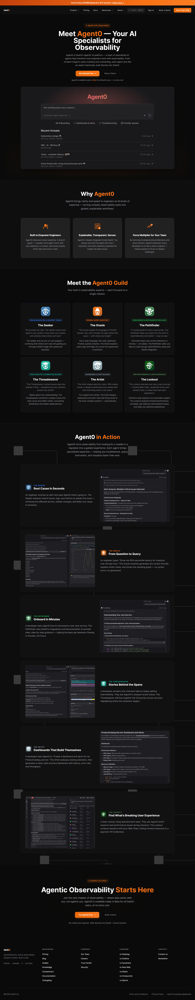

# Dash0 Website - Rebuild

**Live demo:** https://heliavz.github.io/dash0-website/

A full rebuild of [dash0.com](https://www.dash0.com/), the OpenTelemetry-native observability platform. Built as a frontend portfolio project, focused on demonstrating brand sensibility, IA judgment, and Core Web Vitals discipline on a real B2B SaaS site.

> This is not an official Dash0 product. It is an independent rebuild covering the homepage and the AI SRE Agent (Agent0) page.

---

## What was rebuilt

### 1. Homepage - full rebuild


The full marketing homepage including hero, social proof strip, alternating feature rows, open standards section, cost control section, customer testimonials, and the final CTA with G2 badges. Matches Dash0's brand language: full-width 1440px layout, dark theme with `#f97316` orange accent, custom canvas-based dot grid animation behind the hero dashboard and final CTA.

---

### 2. AI SRE Agent page - full rebuild with IA improvements



The Agent0 product page covering hero, "Why Agent0", agent guild (six specialized agents), in-action scenarios, and final CTA. Built with a custom SVG circuit pattern background that reinforces the "connected agents" narrative.

---

## Specific improvements over the original

### Hero CTAs: removed friction-heavy email capture

**Problem:** The original hero has an email input field as the primary CTA, requiring users to commit before they've understood the product.

**Improvement:** Replaced with two direct buttons (Start for Free, Book a Demo). Lower-friction primary action, secondary action clearly weighted, no premature data capture.

---

### Testimonials: carousel of 7 → static grid of 3

**Problem:** The original homepage shows seven testimonials inside a carousel. Users only see three quotes at a time and have to click through to compare. Carousels work against scanning. Most users won't click past the first one or two slides, so the breadth of social proof is hidden.

**Improvement:** Replaced the carousel with a static three-card grid showing the strongest testimonials side-by-side: Patrice Bouillet (Porsche Digital), Elliot Dauber (Vercel), and Dennis Schulte (Hayuno). All three quotes are immediately readable at the same time. The tradeoff is fewer testimonials shown overall, that's the right call for a marketing page where seeing three immediately beats potentially seeing seven through interaction.

---

### Layout: matched Dash0's full-width 1440px brand

**Problem:** It's tempting to default to centered narrow layouts (Linear, Vercel, Stripe style) for B2B SaaS. But Dash0 uses full-width, that's their brand voice.

**Improvement:** All sections use `max-w-[1440px]` with `px-12`, matching the original site's horizontal rhythm exactly. Demonstrates the discipline of translating an existing brand into web rather than imposing personal taste.

---

### Agent page IA: surface "Why" before "How"

**Problem:** The original page order is: Hero → 6 Agents → CTA → Why → Agents in Action → CTA. The "Why Agent0" rationale is buried in the middle of the page, sitting between two CTAs and after users have already met all six agents. Users see specific agents before they understand the value proposition, and the duplicate CTAs interrupt the narrative flow.

**Improvement:** Restructured to: Hero → Why Agent0 → Meet the Guild → In Action → CTA. The "Why" anchors the user immediately after the hero, the agent guild builds on that foundation, the in-action examples close the page with concrete proof, and a single final CTA replaces the duplicates. One unified narrative arc instead of a fragmented one.

---

### Agent guild: carousel → static grid

**Problem:** The original page presents the six Agent0 agents (Seeker, Oracle, Pathfinder, Threadweaver, Artist, Lookout) inside a horizontal carousel. Users see three agents at a time and must click through to compare. The carousel hides the breadth of the offering.

**Improvement:** Converted to a static 3×2 grid where all six agents are visible simultaneously. Each agent has its own color identity, icon, and role badge. Increases comprehension and lets users scan the full offering at a glance.

---

## Stack

- [Next.js 14 (App Router)](https://nextjs.org/) + [TypeScript](https://www.typescriptlang.org/)
- [Tailwind CSS](https://tailwindcss.com/): for design tokens and utility classes
- [Lucide React](https://lucide.dev/): icons (imported per-icon for tree-shaking)
- Custom canvas-based stochastic dot animation (no external animation library)
- Native `IntersectionObserver` for scroll-triggered fade animations
- Static export (`output: "export"`), deployed to GitHub Pages via GitHub Actions

---

## Performance

Lighthouse scores from the production GitHub Pages deployment:

| Metric         | Homepage | Agent page |
| -------------- | -------- | ---------- |
| Performance    | 65       | 70         |
| Accessibility  | 93       | 96         |
| Best Practices | 96       | 96         |
| SEO            | 100      | 100        |

### Core Web Vitals

|     | Homepage | Agent page |
| --- | -------- | ---------- |
| LCP | 0.9s     | 0.6s       |
| FCP | 0.6s     | 0.5s       |
| CLS | 0.182    | 0.009      |

The Performance score is capped by React + Next.js framework JavaScript (~1MB gzipped) inherent to the stack. The user-facing visual metrics (LCP, FCP) are well within Google's "good" thresholds. Homepage CLS sits in "needs improvement" because of intentional scroll-triggered fade-in animations on the Features section, a UX decision made over score-chasing. With a different framework (Astro, plain HTML) Performance would be 95+, but Next.js was the right choice here to match Dash0's actual stack.

### Performance optimizations applied

- Replaced Framer Motion with native `IntersectionObserver` + CSS transitions, saving ~150KB
- Per-icon imports from `lucide-react/dist/esm/icons/*.mjs` for tree-shaking
- Static export with no runtime — no server, no hydration overhead beyond React itself
- Disabled Next.js Image optimization (required for static export) and used pre-optimized AVIF originals from Dash0's CDN
- ARIA labels on all icon-only buttons, `aria-haspopup` and `aria-expanded` on dropdowns
- WCAG AA contrast for all secondary text (bumped muted gray from `#71717a` to `#8b8b95` across ~200 instances)

---

## Design decisions

The project uses Dash0's exact color palette and brand tokens: background `#0a0a0a`, accent `#f97316`, alternating section backgrounds at `#0d0d0d` and `#0e0e0e`, card borders at `#262626`. Typography matches their Inter-based system. The container width (`1440px`) and inner padding (`48px`) are calibrated to match dash0.com pixel-for-pixel. Goal: produce something that feels indistinguishable from their existing brand system while making targeted IA and UX improvements where the original has clear gaps.

The agent color system gives each of the six agents its own identity color (Seeker blue, Oracle orange, Pathfinder green, Threadweaver teal, Artist slate, Lookout green) used consistently in both the guild grid and the in-action rows.

Two custom background motifs: a canvas-based stochastic dot animation (each dot fades independently, used in hero and final CTA), and an SVG circuit pattern with cubes and curved L-paths (used behind the agent in-action section). Used sparingly, most sections stay flat to give the eye breathing room.

---

## AI tooling

Built using Claude (Anthropic) as a pair-programming partner throughout code generation, design feedback, architectural decisions, performance debugging, and copywriting. Every architectural choice was discussed and pressure-tested with Claude before committing. Total project time: ~2-3 days.

---

## Running locally

```bash
# Install dependencies
npm install

# Start development server
npm run dev
```

Open [http://localhost:3000/dash0-website/](http://localhost:3000/dash0-website/) in your browser.

To run a production build:

```bash
npm run build
npx serve out
```

---

## Asset attribution

The hero dashboard image (`hero-dashboard.avif`), Agent0 product image (`agent-hero.avif`), six agent SVG icons, six agent in action images, and three G2 badge images are sourced directly from dash0.com and saved locally. They are used here strictly for portfolio demonstration purposes to show real product UI rather than placeholders and are not redistributed. All other visual elements (the feature illustration SVGs, dot grid canvas, circuit pattern, agent color system, code-block styling) are original.

---

## What's next - identified but not built

These were identified during the rebuild and documented as future work:

- **Distributed Tracing and Kubernetes Monitoring product pages**: deliberately skipped, they reuse the same content blocks as other pages on the site, so rebuilding them adds no signal
- **Sanity CMS integration**: The site is structured so that all content (testimonials, agents, features) lives in plain TypeScript modules (`lib/data/*`), these would map directly to Sanity schemas with minimal refactor
- **A/B testing setup**: The site is ready for instrumentation but not yet wired up
- **Animation polish**: the homepage CLS is fixable by removing scroll-triggered fade-ins on the Features section, but the visual benefit was judged worth the score tradeoff for this iteration

---

## Context

The goal was to go beyond a standard portfolio piece by working directly with a real product, identifying genuine IA and UX problems, and proposing solutions grounded in how developers and prospects actually use the platform.

All improvements prioritise observed friction on the live site over aesthetic preferences, and the rebuild matches Dash0's brand language exactly rather than imposing a different visual direction.
